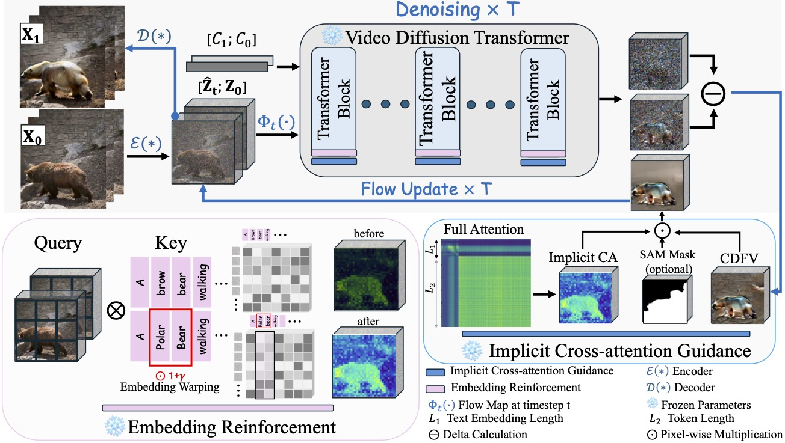
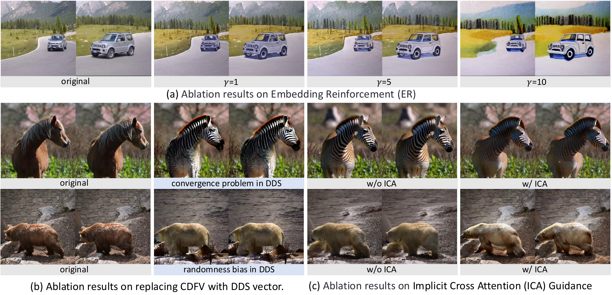

<p align="center">
  
</p>

<h1 align="center">DFVEdit: <span>C</span>onditional <span>D</span>elta <span>F</span>low <span>V</span>ector for <span>Zero-shot</span> <span>V</span>ideo <span>Edit</span>ing</h1>

<p align="center">
  <a href="https://dfvedit.github.io/">
    
  </a>
  <a href="https://arxiv.org/pdf/2506.20967">
    
  </a>
  <a href="https://github.com/LinglingCai0314/DFVEdit">
    
  </a>
  <a href="https://www.python.org/">
    
  </a>
  <a href="https://pytorch.org/">
    
  </a>
</p>

<h4 align="center">
  <a href="https://dfvedit.github.io/">Lingling Cai</a><sup>1</sup> &nbsp;
  <a href="https://kangzhao2.github.io/">Kang Zhao</a><sup>2</sup> &nbsp;
  <a href="https://jacobyuan7.github.io/">Hangjie Yuan</a><sup>1,3</sup> &nbsp;
  <a>Xiang Wang</a><sup>2,4</sup> &nbsp;
  <a href="https://scholar.google.com/citations?user=16RDSEUAAAAJ">Yingya Zhang</a><sup>2</sup> &nbsp;
  <a href="https://scholar.google.com/citations?user=6tSoD98AAAAJ">Kejie Huang</a><sup>1</sup>
</h4>

<h5 align="center">
  <sup>1</sup>Zhejiang University &nbsp;&nbsp;
  <sup>2</sup>Tongyi Lab &nbsp;&nbsp;
  <sup>3</sup>DAMO Academy &nbsp;&nbsp;
  <sup>4</sup>Huazhong University of Science and Technology
</h5>

<br>

---

## 🔥 Updates

- **[2025-06-27]**: 🎉 Paper available on arXiv! [arXiv:2506.20967](https://arxiv.org/abs/2506.20967)
- **[2025-03-03]**: 🔥 Code released for Wan2.1 model!

## 📖 Abstract

> The advent of Video Diffusion Transformers (Video DiTs) marks a milestone in video generation. However, directly applying existing video editing methods to Video DiTs often incurs substantial computational overhead, due to resource-intensive attention modification or finetuning. To alleviate this problem, we present **DFVEdit**, an efficient zero-shot video editing method tailored for Video DiTs. DFVEdit eliminates the need for both attention modification and fine-tuning by directly operating on clean latents via flow transformation. To be more specific, we observe that editing and sampling can be unified under the continuous flow perspective. Building upon this foundation, we propose the **Conditional Delta Flow Vector (CDFV)** -- a theoretically unbiased estimation of DFV -- and integrate **Implicit Cross Attention (ICA)** guidance as well as **Embedding Reinforcement (ER)** to further enhance editing quality. DFVEdit excels in practical efficiency, offering **at least 20x inference speed-up** and **85% memory reduction** on Video DiTs compared to attention-engineering-based editing methods.

## ✨ Key Features

- ⚡ **High Efficiency**: **20x faster** inference and **85% less memory** than attention-based methods
- 🎬 **Zero-Shot Editing**: No fine-tuning or attention modification required
- 🔧 **Wan2.1 Support**: Full support for **Wan2.1** (1.3B/14B) Flow Matching models
- 📦 **Diffusers Integration**: Built on Hugging Face Diffusers for easy model loading and inference
- 🧠 **Modular Design**: Clean codebase with separated modules for config, text, video, and sampling

## 🏗️ Method Overview

<p align="center">
  
</p>

## 📊 Benchmark

### Quantitative Comparison

We compare DFVEdit with state-of-the-art video editing methods on CogVideoX-5B:

| Method | CLIP-F↑ | E_warp↓ | M.PSNR↑ | LPIPS↓ | CLIP-T↑ | VRAM↓ | Latency↓ |
|--------|---------|---------|---------|--------|---------|-------|----------|
| SDEdit | 0.9811 | 1.67 | 20.52 | 0.4090 | 27.46 | 1.01× | **0.87×** |
| FateZero | 0.9289 | 3.09 | 23.39 | 0.2634 | 26.08 | 2.32× | 3.40× |
| TokenFlow | 0.9583 | **1.48** | 29.97 | 0.2247 | 29.78 | 1.43× | 13.03× |
| VideoGrain | 0.9695 | 2.68 | 30.70 | 0.2948 | 27.79 | 2.35× | 13.44× |
| FreeMask | 0.9699 | 2.00 | 29.92 | 0.2314 | 27.06 | 1.64× | 5.65× |
| **DFVEdit (Ours)** | **0.9924** | **1.12** | **31.18** | **0.1886** | **30.84** | **0.95×** | **1.20×** |

> **Key Results**: DFVEdit achieves **SOTA** performance on all quality metrics while maintaining **minimal computational overhead** (0.95× VRAM, 1.20× latency relative to base model inference).

### Computational Efficiency

DFVEdit is significantly more efficient than attention-engineering-based methods:

| Metric | FateZero | TokenFlow | VideoDirector | **DFVEdit** |
|--------|----------|-----------|---------------|-------------|
| Relative VRAM | 2.32× | 1.43× | 6.00× | **0.95×** |
| Relative Latency | 3.40× | 13.03× | 27.97× | **1.20×** |

> DFVEdit achieves **20×+ speedup** and **85% memory reduction** compared to attention-based editing methods when applied to Video DiTs.

### Cross-Architecture Generalization

| Base Model | CLIP-F↑ | E_warp↓ | M.PSNR↑ | LPIPS↓ | CLIP-T↑ |
|------------|---------|---------|---------|--------|---------|
| CogVideoX-5B (Score Matching) | 0.9924 | 1.12 | 31.18 | 0.1886 | 30.84 |
| Wan2.1-14B (Flow Matching) | **0.9950** | **1.06** | **31.23** | **0.1568** | **31.34** |

> DFVEdit generalizes well across different Video DiT architectures, including both **Score Matching** (CogVideoX) and **Flow Matching** (Wan2.1) based models.

### User Study

| Method | Edit Quality↑ | Overall Quality↑ | Consistency↑ |
|--------|---------------|------------------|--------------|
| SDEdit | 66.57 | **80.45** | **85.66** |
| TokenFlow | 70.12 | 53.45 | 57.41 |
| VideoGrain | 76.41 | 79.87 | 70.61 |
| **DFVEdit (Ours)** | **87.65** | **84.56** | **86.98** |

## 🎬 Visual Results

### Qualitative Comparison

<p align="center">
  
</p>

> DFVEdit achieves superior performance in **structural fidelity**, **motion integrity**, and **temporal consistency** compared to existing methods.

### Ablation Study

<p align="center">
  
</p>

> Ablation results demonstrating the effectiveness of **ICA** (Implicit Cross-Attention) and **ER** (Embedding Reinforcement) components.

## 🎬 Video Demos

### Comparison Results

> Demonstration videos comparing DFVEdit with other methods

| Comparison 1 | Comparison 2 | Comparison 3 |
|:------------:|:------------:|:------------:|
| [Watch](https://dfvedit.github.io/static/videos/1_comparison_1.mp4) | [Watch](https://dfvedit.github.io/static/videos/2_comparison_2.mp4) | [Watch](https://dfvedit.github.io/static/videos/3_comparison_3.mp4) |

### Ablation Results

> Ablation study demonstrating the effectiveness of each component

| Ablation 1 | Ablation 2 |
|:----------:|:----------:|
| [Watch](https://dfvedit.github.io/static/videos/4_ablation_1.mp4) | [Watch](https://dfvedit.github.io/static/videos/5_ablation_2.mp4) |

### Extensive Results

> More video editing examples across various scenarios

| Example 1 | Example 2 | Example 3 | Example 4 |
|:---------:|:---------:|:---------:|:---------:|
| [Watch](https://dfvedit.github.io/static/videos/6_extensive_1.mp4) | [Watch](https://dfvedit.github.io/static/videos/7_extensive_2.mp4) | [Watch](https://dfvedit.github.io/static/videos/8_extensive_3.mp4) | [Watch](https://dfvedit.github.io/static/videos/9_extensive_4.mp4) |

## 📦 Supported Models

| Model | Size | HuggingFace ID | Status |
|-------|------|----------------|--------|
| **Wan2.1** | 14B | `Wan-AI/Wan2.1-T2V-14B-Diffusers` | ✅ Supported |
| **Wan2.1** | 1.3B | `Wan-AI/Wan2.1-T2V-1.3B-Diffusers` | ✅ Supported |
| **HunyuanVideo** | - | `tencent/HunyuanVideo` | ✅ Supported |
| CogVideoX | 2b/5b | `THUDM/CogVideoX-5B` | 🔜 Coming Soon |
| Stable Diffusion | 1.5/2.1 | - | 🔜 Coming Soon |

## 🎮 Quick Start

```bash
# 1. Clone the repository
git clone https://github.com/LinglingCai0314/DFVEdit.git
cd DFVEdit

# 2. Install dependencies
pip install -r requirements.txt

# 3. (Optional) Set environment variables
export CKPT_ROOT=/path/to/models
export DATA_ROOT=/path/to/data
export OUTPUT_ROOT=./experiments

# 4. Run video editing
python scripts/run_edit.py --config config/video_editing/twodogs_rightfox.yaml
```

### Command Line Options

```bash
# Basic usage
python scripts/run_edit.py --config config/video_editing/twodogs_rightfox.yaml

# Debug mode
python scripts/run_edit.py --config my_config.yaml --debug

# Verbose logging
python scripts/run_edit.py --config my_config.yaml -v
```

## 📥 Installation

### Requirements

| Package | Minimum | Recommended |
|---------|---------|-------------|
| diffusers | 0.30.0 | 0.32.0+ |
| transformers | 4.40.0 | 4.44.0+ |
| torch | 2.0.0 | 2.2.0+ |
| accelerate | 0.30.0 | 0.33.0+ |

### Setup

```bash
# Create virtual environment
python -m venv venv
source venv/bin/activate  # Linux/Mac
# or: .\venv\Scripts\activate  # Windows

# Install dependencies
pip install -r requirements.txt

```

## 🚀 Usage

### Config-Driven (Recommended)

```bash
# Set environment variables (optional, defaults available)
export CKPT_ROOT=/path/to/models
export DATA_ROOT=/path/to/data
export OUTPUT_ROOT=./experiments

# Run with config file
python scripts/run_edit.py --config config/video_editing/twodogs_rightfox.yaml

# Override model
python scripts/run_edit.py --config config/video_editing/twodogs_rightfox.yaml --model wan
```

### Configuration System

DFVEdit uses a **simplified configuration system** following DRY principles:

```
config/
├── video_editing/
│   ├── models.yaml          # Model registry (defaults for all models)
│   ├── bear2polar.yaml      # Task config (only task-specific params)
│   └── man2robot.yaml
└── image_editing/
    ├── models.yaml          # Model registry
    └── dog2tiger.yaml       # Task config
```

**models.yaml** - Centralized model defaults:
```yaml
defaults:
  dtype: bfloat16
  num_inference_steps: 50
  guidance_scale_source: 5.0
  guidance_scale_target: 15.0

models:
  wanx:
    path: ${CKPT_ROOT}/Wan-AI/Wan2.1-T2V-14B-Diffusers
    video:
      height: 480
      width: 864
      num_frames: 40
```

**Task config** - Only specify what's unique:
```yaml
# dfvedit/configs/examples/bear_shape.yaml
input: ${DATA_ROOT}/videos/bear.mp4
output: ${OUTPUT_ROOT}/bear2polar

prompt_original: "a brown bear walking."
prompt_target: "a white polar bear walking."

# Optional: Token amplification for emphasizing words
token_amplify:
  words: ['▁white', '▁Polar', '▁bear']
  amplitude: 2.0
  enabled: true

# Optional: Save configuration
save:
  every: 5
  steps: [0, 25, 49]
```

### Legacy Config Format (Backward Compatible)

Old configs with `dataset_config` and `editing_config` are still supported:

```yaml
# Old format (still works)
dataset_config:
  input_path: /path/to/video.mp4
  source_prompt: "original"
  target_prompt: "target"
editing_config:
  num_inference_steps: 50
```

## 📁 Project Structure

```
DFVEdit/
├── dfvedit/                   # Main Python package
│   ├── __init__.py
│   ├── configs/               # Configuration files
│   │   ├── models.yaml        # Model registry (defaults)
│   │   └── examples/          # Example task configs
│   ├── config/                # Config schema & loader
│   │   ├── schema.py          # Dataclass definitions
│   │   └── loader.py          # ConfigLoader with env vars
│   ├── core/                  # Core functionality
│   │   ├── types.py           # Type aliases
│   │   ├── pipeline_factory.py # Pipeline builders
│   │   └── runner.py          # Main editing loop
│   ├── samplers/              # Sampling & optimization
│   │   ├── dfv_sampler.py     # DFV sampler (CDFV computation)
│   │   ├── optim.py           # Custom SGD optimizer
│   │   └── schedules.py       # Timestep/sigma utilities
│   ├── text/                  # Text processing
│   │   ├── clean.py           # Prompt cleaning utilities
│   │   ├── prompt_clean.py    # Backward-compatible aliases
│   │   ├── t5_embed.py        # T5 text encoder
│   │   └── token_amp.py       # Token amplification
│   ├── video/                 # Video processing
│   │   ├── io.py              # Video load/export
│   │   ├── preprocess.py      # Pre/post processing
│   │   └── mask.py            # Mask handling
│   └── utils/                 # Utilities
│       ├── logging.py         # Logging setup
│       ├── seed.py            # Random seed
│       └── misc.py            # Helper functions
├── scripts/
│   └── run_edit.py            # Entry point script
├── dfvedit_wanx.py            # Legacy single-file (kept for reference)
└── requirements.txt
```

### Module Overview

| Module | Purpose |
|--------|---------|
| `dfvedit.config` | Configuration schema and loading |
| `dfvedit.core` | Pipeline factory and main runner |
| `dfvedit.samplers` | DFV sampling, SGD optimizer, schedules |
| `dfvedit.text` | Prompt cleaning, T5 encoding, token amplification |
| `dfvedit.video` | Video I/O, preprocessing, mask handling |
| `dfvedit.utils` | Logging, seeding, misc utilities |


## 🙏 Acknowledgments

- [Hugging Face Diffusers](https://github.com/huggingface/diffusers)
- [CogVideoX](https://github.com/THUDM/CogVideoX)
- [Wan2.1](https://github.com/Wan-ai/Wan2.1)


## 📜 Citation

If you find our work useful in your research, please consider citing:

```bibtex
@misc{cai2025dfvedit,
    title={DFVEdit: Conditional Delta Flow Vector for Zero-shot Video Editing on DiTs},
    author={Cai, Lingling and Zhao, Kang and Yuan, Hangjie and Wang, Xiang and Zhang, Yingya and Huang, Kejie},
    year={2025},
    eprint={2506.20967},
    archivePrefix={arXiv},
    primaryClass={cs.CV},
    url={https://arxiv.org/abs/2506.20967},
}
```

## 📄 License

This project is licensed under the MIT License - see the [LICENSE](LICENSE) for details.

## 📋 TODO / Roadmap

- [x] Wan2.1 (14B) model support
- [x] Modular codebase refactoring
- [x] Configuration system with model registry
- [x] Token amplification feature
- [ ] CogVideoX (2b/5b) model support
- [ ] Stable Diffusion (1.5/2.1) image editing support
- [ ] Gradio Web UI
- [ ] ComfyUI integration
- [ ] Detailed documentation and tutorials
- [ ] Unit tests and CI/CD

## 🤝 Contributing

Contributions are welcome! Please feel free to submit a Pull Request.

---

<p align="center">
  <a href="https://dfvedit.github.io/">🏠 Project Page</a> •
  <a href="https://arxiv.org/pdf/2506.20967">📄 Paper</a> •
  <a href="https://github.com/LinglingCai0314/DFVEdit">📦 Code</a> •
  <a href="https://dfvedit.github.io/static/videos/DFVEdit.mp4">🎬 Demo Video</a>
</p>
